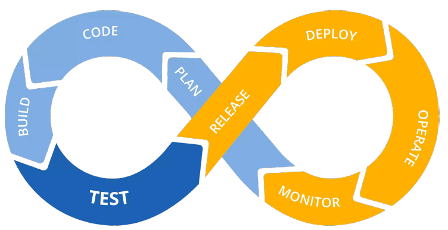

# What is Devops?

Let's start with an understanding of Devops in general.

Devops is a set of practices that emphasizes collaboration and communication between developers and IT operation professionals, while also integrating automation and continuous feedback to improve the speed and quality of software delivery.

So, the idea is to create a culture where software delivery is accomplished timely and in an efficient way by embracing a mindset of collaboration. In other words, it is about creating a harmony between all stakeholders in an IT company.

## Why did Devops emerge?

Traditionally, software development and IT operations were separate teams with different goals and priorities. This often led to silos, communication breakdowns, and slow delivery times. DevOps seeks to bridge this gap by bringing together the development and operations teams into a more integrated and collaborative environment.

## How does Devops differ from Traditional Software development life cycle?

In the old fashioned way, software development life cycle (SDLC) models, such as waterfall model were utilized. In waterfall model, software development was divided into stages or phases. Each stage of a software had to be completed before moving on a next stage. This ensured that the software was free of bugs and working as expected before moving to a next stage; however, it required a considerable amount of time for each stage to finish leading to longer software delivery times. Furthermore, teams had to wait each other to finish their workloads in order to continue working their own tasks.

Devops adopts a CI/CD process in which SDLC happens continuously and efficiently. Teams do work in collaboration with each other.The software code is continously created, modified, tested,integrated, deployed and delivered and as a result leading to fast and reliable delivery times.

## What are the core principles of Devops?

It is all about collaboration, automation, continuous feedback, and continuous improvement. By working together and continuously improving their processes, teams can reduce the time it takes to deliver software while also increasing its quality and reliability.
This principles will make more sense once we dive into the core concepts and tools utilized by Devops engineers.

## What are some of the most popular tools and technologies used by Devops?

As I mentioned at the beginning, Devops is a vast field and there are numerous tools that are used by Devops engineers. However, some of these tools have become standart in the field.

Some of the popular tools and technologies used in DevOps include version controlling, such as GitHub and GitLab, containerization, such as Docker, container orchestration, such as Kubernetes, continuous integration and continuous deployment (CI/CD) tools, such as Jenkins, infrastructure as code tools, such as Terraform, configuration management tools, such as Ansible, and cloud computing platforms such as, AWS, Azure, and Google Cloud.

Each of these tools require considerable amount of time to understand and master but the benefits they provide in terms of efficiency, scalability, and automation make them essential components of modern DevOps practices. By investing in learning and using these tools effectively, DevOps teams can streamline their workflows, reduce errors and downtime, and ultimately deliver higher quality software more quickly and reliably.