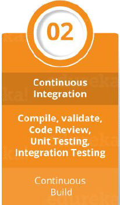

# A high level overview of Devops

I will provide a high level overview of a CI/CD process which is at the core of Devops. This may be overwhelming when you just start learning Devops concepts; however, it gives an idea on why Devops uses many tools and how each of these tools help accomplish Devops tasks.

The main purpose of IT companies is to provide a software to a customer. Let's call it an application. The application is built with a high level programming language, such as Python or Javascript. 

In order to develop the code, IT companies naturally employ software developers. These developers use IDE's (Integrated Development Environments) to write their codes and they also utilize version control systems ,such as git to keep track of the application code.

Online version control systems, such as GitHub and GitLab provides the opportunity to store these codes remotely. Moreover, these systems provide multiple developers to be able to work on the same code simultaneously. Also version control systems play an important role in the continuous integration of the application code that helps ensure that software is delivered quickly and reliably.

When a developer writes a new code or modifies the existing code, the new application code must be tested to make sure that it works smoothly and it's free of any types of bugs. These tests are written using tools, such as Selenium which is an automated testing tool. Also, build automation tools like Maven helps create artifacts of the new code when it passes the initial tests. These artifacts are compiled as jar or war files and they are made up of both the application code and the dependencies.

These build artifacts are then used to create Docker images, which are lightweight containers that can be easily deployed to a variety of environments. Docker images allow developers to package their application code and dependencies into a single, portable package, which can be run consistently across different environments. This makes it easier to deploy new code changes and ensure that applications are running in a consistent and reliable way. Additionally, using Docker images in the CI/CD process allows for automated testing and deployment of new code changes, further streamlining the software development process.

Now that the Docker images are ready with the new application code, CI/CD tools like Jenkins,GitLab CI/CD, Travis CI, or CircleCI is used to create a pipeline to deploy the new application code. For example, Jenkins provides an interface where Devops engineers can create jobs to initiate CI/CD pipelines. Jenkins integrates with version control systems and through webhooks, CI/CD process is triggered once the new Docker image is uploaded to the repository (Webhooks are automated notifications that are triggered when certain events occur, such as when new code is pushed to a version control system).

Jenkins can be used to automate the deployment of new code changes to production environments, using tools like Kubernetes or Docker Swarm.  Kubernetes is an open-source platform that automates the deployment, scaling, and management of containerized applications. It provides a way to abstract the underlying infrastructure and provide a consistent way to manage containers across different environments. Similarly, Docker Swarm is a container orchestration platform that allows developers to deploy and manage Docker containers at scale. With Jenkins, DevOps engineers can create custom deployment pipelines that incorporate tools like Kubernetes or Docker Swarm, allowing for automated deployments to production environments. For example, a typical Jenkins deployment pipeline might include stages for building the Docker image, testing the application, and deploying the new code to a production environment using Kubernetes or Docker Swarm. By automating these deployment stages, developers can quickly and easily deploy new code changes to production environments, while also ensuring that the application is stable and reliable.

I also need to mention the Infrastructure as Code (IAC) process. In addition to deploying new code changes to production environments, DevOps engineers also need to manage the underlying infrastructure that supports these applications. This is where the concept of IAC comes in. Both the developers and the customers need infrastructure for the application to run on. Whether it is a development environment or the production environment, servers are needed to host applications. These servers can be spun up and configured automatically using IAC tools like Terraform or CloudFormation of Amazon Web Services (AWS). With these tools, DevOps engineers can define the infrastructure requirements for their applications using code, just like they would for application code. They can then use these code files to automatically provision and manage the necessary infrastructure resources, such as servers, load balancers, and databases. This approach provides many benefits, including increased agility, consistency, and scalability, while also reducing the risk of human error and improving overall system security.

This is a high level overview of the process. I hope that you can all understand the process once you learn the basics of the tools mentioned in the overview. While the CI/CD process seenms complex and involve many different tools and technologies, it is ultimately a process that can be learned and mastered with practice and experience. So get ready to roll on and master these tools.