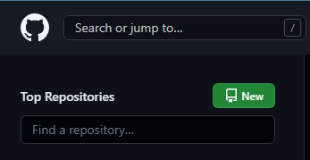
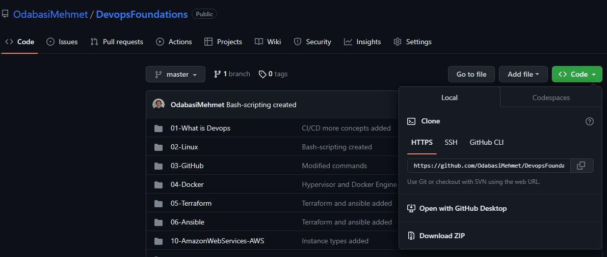

Github is one of the most popular version control systems. It is an online platform where developers can store and share their code with other developers. It provides an easy way to manage and collaborate on code, as well as track changes to the code over time. With GitHub, developers can create repositories to store their code, work together on the same codebase, and track issues and bugs that need to be fixed. Additionally, GitHub provides a variety of tools and integrations that make it easy to automate workflows, deploy code, and create CI/CD pipelines.

## Working with Github

* First, you need to create an account on https://github.com/

* Then, you should list your credentionals as a local user to validate your identity.

```bash
git config --global user.name "John Doe"
git config --global user.email "johndoe@example.com"
```
## How to create a repository on Github 

1. Log into your Github account

2. Click on the green `New` button on the top left to create a new repo.


3. Provide a name for your repo.
4. Choose whether it will be public (anyone can access) or private (only those you allow can access) the repo.
5. Optionally you can add a readme file.
6. Click on Create repository
7. Go a terminal on your local, and paste the following commands (Github provides you these commands)
```bash
echo "# Testing" >> README.md
git init
git add README.md
git commit -m "first commit"
git branch -M master
git remote add origin https://github.com/OdabasiMehmet/Testing.git
git push -u origin master
```
## How to Clone a repository

If you want to clone a repository from Github all you have to do is to go to that repository, click on the green code button on the right and once the dropdown menu is opened click on the copy icon to copy the repo address. Then go to your local, open a terminal, and enter git clone followed by the copied repo address.

```bash
git clone https://github.com/OdabasiMehmet/DevopsFoundations.git
```


