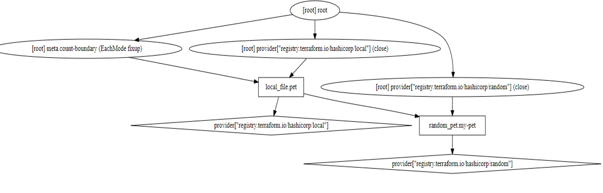

Here is a list of terraform commands

* terraform init

* terraform plan

* terraform apply

* terraform validate: Check terraform sysntax before running plan or apply command.

* terraform format: Scan the configuration file and improve the readability of the code by formatting it into a canonical format.

* terraform show: Print out the current state of the resources

* terraform show -json: We can use -json flag to see the output in json format

* terraform providers: To see a list of all providers in configuration directory

* terraform output: Print out all of the output variables

* terraform refresh: Sync the terraform state file with the real world infrastructure. It will  modify the state file.

Note: Terraform plan and apply commands also automatically run terraform refresh.

* terraform graph: Create a visual representation of the configuration

Note: It is better to use graph with additional software such as grapviz to make a better visual experience.

1. apt install graphiz
2. terraform graph | dot -Tsvg > graph.svg
3. Open the graph.svg file in a browser




```