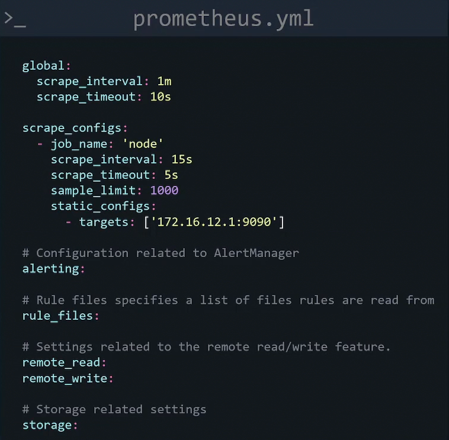

Prometheus works as a pull model so prometheus server must be configured to retrive metrics. The configuration is kept in the prometheus.yml file under /etc/prometheus directory.

Below is a sample config file for prometheus

A job is a collection of instances that need to be scraped. We can define the IP of the instances under target section.

Under scrape_configs, we can add a key value pair of scheme: https if we want to scrape using https instead of default http. Also, if instead of default /metrics path, you want to use another path, you can specify it as metrics_path: /stats/metrics.

We can also set authorization header on every request by configuring a username and password:

basic_auth:
  [ username: value]
  [ password: secret]
  [ password_file: value]

If you make any chamges to proketheus.yml file, you need to restart prometheus. To do that ctrl+c and restart executable file or if installed as systemd then systemctl restart prometheus